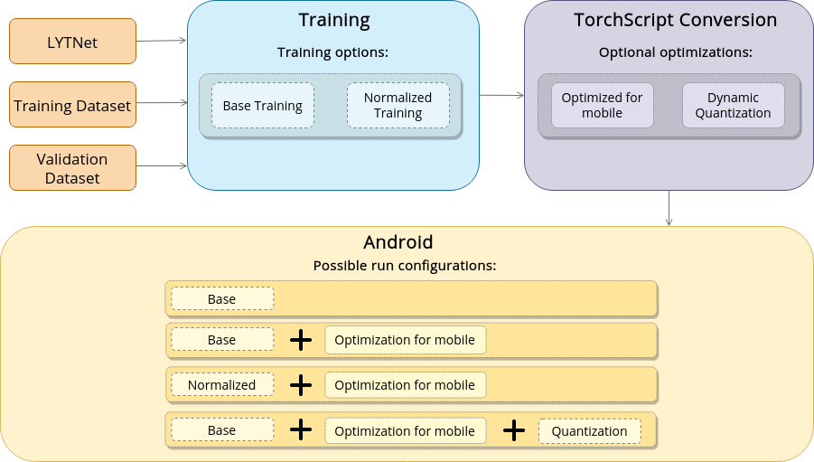

# eyeDo: an Android Application for the Visually Impaired that use LytNet Neural Network to recognize Pedestrian Traffic Light

The implementation of the CNN done is explained in this paper: https://arxiv.org/abs/1907.09706. The project on which we have based is ImVisible: https://github.com/samuelyu2002/ImVisible

### Introduction
In this project we train a neural network called LytNet, then we convert the model from Pytorch to TorchScript and develop an Android App that use it to recognize pedestrian traffic light. The following image rappresent the approach followed and the related path options.

To train and test the CNN we have used Pedestrian-Traffic-Lights (PTL) that is a high-quality image dataset of street intersections, created for the detection of pedestrian traffic lights and zebra crossings. Images have variation in weather, position and orientation in relation to the traffic light and zebra crossing, and size and type of intersection. To download the dataset visit ImVisible project (link above).

## Training

|   | Training | Validation | Testing | Total
|---|----------|------------|---------|-------
Number of Images | 3456 | 864 | 739 | 5059
Percentage | 68.3% | 17.1% | 14.6% | 100%

Use these stats for image normalization:  
mean = [120.56737612047593, 119.16664454573734, 113.84554638827127]  
std=[66.32028460114392, 65.09469952002551, 65.67726614496246]

### Labels

Classes are as follows:

0: Red

1: Green

2: Countdown Green

3: Countdown Blank

4: None

Here are the precisions of networks for each class:

|   | Red | Green | Countdown Green | Countdown Blank | None
|---|-----|-------|-----------------|-----------------|--------|
Base Precision | 0.955 | 0.945 | 0.985 | 0.929 | 0.774
Normalized Precision | 0 | 0 | 0 | 0 | 0

Our network is adapted from MobileNet, with a larger input size of 768x576 designed for image classification tasks that involve a smaller object within the image (such as a traffic light). Certain layers from MobileNet v2 were removed for the network to run at a near real-time frame rate (21 fps), but still maintain high accuracy. 

This is the structure of LytNet:

### Conversion
We wrote the code that convert Pytorch model to TorchScript and then we have integrated it inside Android. 

The network need structure that need transposed shape so we have switched height/width/channel to channel/height/width with Numpy transpose function. See fromPTtoPTScript.py for more information about.

## Application
We developed an Android Application that use the model converted. You can find the repo here: https://github.com/marcoleino/eyeDo_Android/tree/master
